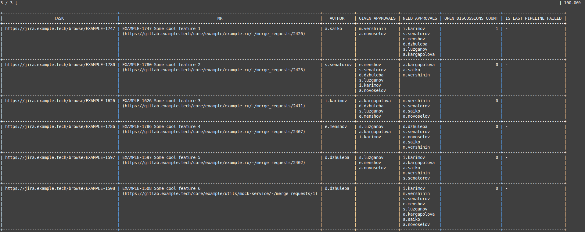

## Mrboard

CLI dashboard for Gitlab merge requests



## How to use

1. Clone repository `git clone git@github.com:xpohoc69/mrboard.git`
1. Build a program `docker run --rm -v "$PWD":/usr/src/myapp -w /usr/src/myapp golang:1.18 go build -v`
1. Copy .env.example to .env and fill variables from it
1. Run program `./mrboard -env="path to .env file"`

## Available options

`./mrboard -help`

```
-env string
    Path to .env file. Default is current directory
-mine
    Show merge requests where I am the author. Default is false
-nma
    Show merge requests where my approval is needed. Default is false
```
